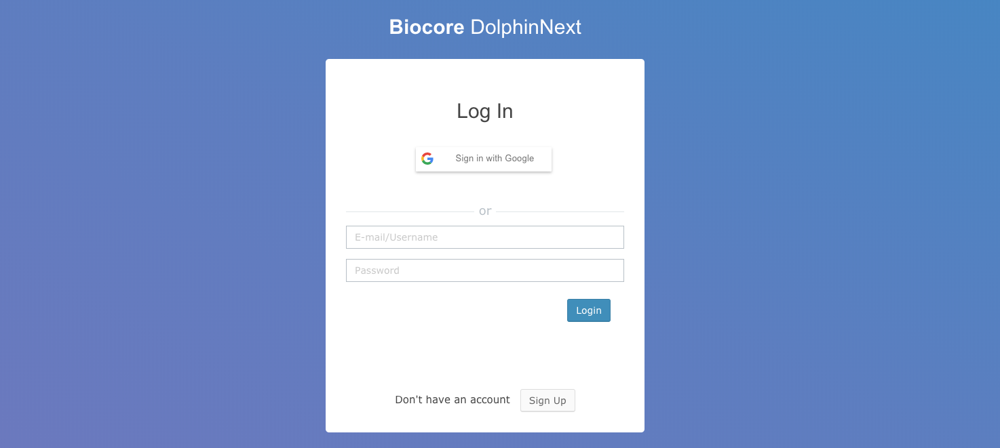
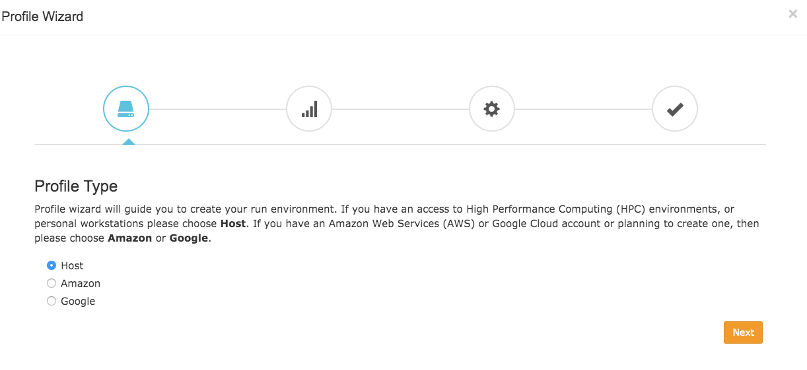

*****************
Quick Start Guide
*****************

Signing Up
==========

This guide will walk you through how to start using ViaFoundry (formerly DolphinNext) pipelines. First off, you need to navigate to the ViaFoundry web page at https://www.viafoundry.com and click the ``Log in`` button. You will be asked to enter your institute's log-in information. An email will be sent to you once your information has been verified. 

Creating Profile
================

Once you enter the ViaFoundry platform, the ``Profile Wizard`` will open as shown below. 

Note:

    If you need to re-open the Profile Wizard window, you can simply click on the ``Wizard`` button at the top right.

    .. image:: dolphinnext_images/profilewizard_button.png
	   :align: center
	   :width: 45%

Note:

If you have any issues or questions about creating profiles, please contact us at: support@viafoundry.com

1. First, choose your profile type:

    A. If you have an access to High Performance Computing (HPC) environment or a personal workstation, then please choose ``Host``. 
    B. If you have an Amazon Web Services (AWS) account or are planning to create one, then please choose ``Amazon`` and follow our `Amazon Guide <https://dolphinnext.readthedocs.io/en/latest/dolphinNext/profile.html#b-defining-amazon-profile>`_  to create your run environment.
    C. If you have an Google Cloud account or planning to create one, then please choose ``Google`` and follow our `Google Guide <https://dolphinnext.readthedocs.io/en/latest/dolphinNext/profile.html#c-defining-google-profile>`_ to create your run environment.
    D. If you choose the ``MGHPCC cluster`` option, you can upload your files to our MGHPCC cluster to process your data and download your results from the Report section. However, you will not have direct access to our cluster.
    
Note:

If you choose the MGHPCC option, you can skip the rest of this guide and go to the `Running Pipelines Section <quick.html#running-pipelines>`_.
        
2. Second, add a public SSH Key into your host machine.

    -  Please confirm our `Terms and Conditions <https://dolphinnext.umassmed.edu/php/terms.php>`_ & `Privacy Policy <https://dolphinnext.umassmed.edu/php/privacy.php>`_ by clicking checkbox.
    -  Here, a public key is securely generated for your account and is required to be added into ``~/.ssh/authorized_keys`` in the host by the user. Please check our `Adding Public SSH Key Section <public_ssh_key.html>`_ for help. 
    -  After adding public key, please click Validate SSH Keys button to finalize this section.
    
**Important:**

**Username/Hostname:** You should enter your username and the hostname of the host to which you would like to connect (yourusername@yourhostname). For instance, for the account us2r@ghpcc06.umassrc.org::
    
        *  Username: yourusername (eg. us2r)
        *  Hostname: yourhostname (eg. ghpcc06.umassrc.org)
    

3. Third, install/validate software dependencies into the host machine.

In order to execute our pipelines, Nextflow should be installed into your host environment. Since most of our pipelines isolate their dependencies within their Docker or Singularity containers, please install these softwares into your machine by following the guidelines below. If your platform doesn't support the installation of Docker, you can still use our pipelines with just Singularity.
    
    -  Installing `Nextflow <faq.html#how-can-i-install-nextflow>`_ 
    -  Installing `Singularity (Version 3) <faq.html#how-can-i-install-singularity>`_ 
    -  Installing `Docker <faq.html#how-can-i-install-docker>`_ 

    
    **Software Dependencies Section:**

    -  **JAVA Command (optional):** If JAVA is not added to the $PATH environment, you can run the  command (``module load java/8.0``) to manipulate your $PATH environment and gain access to JAVA.
    
    -  **Nextflow Path or Command (optional):** If Nextflow is not added to $PATH environment, you can either enter the path of the nextflow (eg. ``/project/bin``), or run the command (``module load nextflow``) to manipulate your $PATH environment and gain access to new software. 
    
    -  **Docker/Singularity Command (optional):** You can run a command (eg. ``module load docker/1.0.0`` or ``module load singularity/3.0.0``) to manipulate your $PATH environment in order to gain access to new software. 
    
4. General run settings can be set by following the **Run settings** section:

    -  **Executor of Nextflow:** Nextflow itself is initiated with this method, which will be only used for running nextflow itself.
    
    -  **Executor of Nextflow Jobs:** This setting will be used as the default setting for submitted jobs by Nextflow.
    
    -  **Download Directory:** Used to download shared pipeline files such as genome indexes. If your platform already has an allocated path for such files, please enter that path. Otherwise, you can set any path that you have permission to write. e.g. ``/share/viafoundry/downloads``

Once you complete these steps, you're now able to start using publicly available pipelines.

Running Pipelines
=================

.. raw:: html

    

        <iframe src="https://www.youtube.com/embed/gaq_LwewFPA" frameborder="0" allowfullscreen style="position: absolute; top: 0; left: 0; width: 100%; height: 100%;"></iframe>
    

     

1. The easiest way to run a pipeline is from the main page, by clicking the ``Biocore ViaFoundry`` button at the top left of the screen. From here, you can investigate publicly available pipelines as shown below and select the pipeline you want to run by clicking the ``Learn More`` button.

    .. image:: dolphinnext_images/main_page.png
	   :align: center

2. Once the pipeline is loaded, you will notice a ``Run`` button at the right top of the page.

    .. image:: dolphinnext_images/project_runbutton.png
	   :align: center
	   :width: 35%

3. This button opens a new window, where you can create a new project by clicking ``Create a Project``. After you enter and save the name of the project, it will be added to your project list. Now you can select your project by clicking on it, as shown in the figure below.

    .. image:: dolphinnext_images/project_pipeselect.png
	   :align: center

4. Now, you may proceed with entering your desired run name, which will be added to your project's run list. Clicking ``Save Run`` will redirect you to the "Run Page".

5. Initially, in the header of the run page, an orange ``Waiting`` button will be shown. In order to initiate a run, the following data need to be entered:

    .. image:: dolphinnext_images/run_header_waiting.png
	   :align: center

    A. **Work Directory:**  Full path of the directory, where Nextflow runs will be executed.
    
        .. image:: dolphinnext_images/run_params_work.png
	   :align: center
	   :width: 99%
    
    B. **Run Environment:** Profile that is created in the `profile <profile.html>`_  page. If an `Amazon profile <profile.html#b-defining-amazon-profile>`_ or a `Google profile <profile.html#c-defining-google-profile>`_ is selected, then the status of the profile should be "**running**".
    
        .. image:: dolphinnext_images/run_params_env.png
	   :align: center
	   :width: 99%
    
    C. **Inputs:** The value and path of the files need to be entered. For detailed information, please check the `adding files section. <quick.html#adding-files>`_ 

        .. image:: dolphinnext_images/run_params_inputs.png
	   :align: center
	   :width: 50%

6. Once all requirements are satisfied, the ``Waiting`` button will turn into a green ``Ready to Run`` button as shown below. You can initiate your run by clicking the ``Ready to Run`` button. Please go through the `run page <run.html>`_ for detailed explanation about each module is used.
    
    .. image:: dolphinnext_images/run_header_ready.png
	   :align: center

Adding Files
============

Remote Files
------------
You can reach your remote files by entering:

    - Full path of a directory: eg. ``/share/data/umw_biocore/genome_data/mousetest/mm10/gz``
    - Web link: eg. ``https://galaxyweb.umassmed.edu/pub/dnext_data/test/reads``
    - Amazon (S3) Bucket: eg. ``s3://biocore/fastq``
    - Google (GS) Bucket: eg. ``gs://biocore/fastq``

Geo Files
---------

If you want to download and use NCBI (GEO data) in the pipeline, you can simply use the ``GEO Files`` tab. Here are the few examples for GEO ID: ``GSM1331276``, ``GSE55190``, ``SRR10095965``
    
Upload Files
------------
If you need to upload your local files and transfer into **Target Directory in the Host**, you can use the ``Upload Files`` tab.

For detailed information about adding files, feel free to reference our tutorial video:
        
    .. raw:: html

        

            <iframe src="https://www.youtube.com/embed/3QaAqdyB11w" frameborder="0" allowfullscreen style="position: absolute; top: 0; left: 0; width: 100%; height: 100%;"></iframe>
        

         
 
 
How To Cite Us
==============

If you use ViaFoundry (formerly DolphinNext) in your research, please cite:

Yukselen, O., Turkyilmaz, O., Ozturk, A.R. et al. DolphinNext: a distributed data processing platform for high throughput genomics. BMC Genomics 21, 310 (2020). https://doi.org/10.1186/s12864-020-6714-x

 
 

